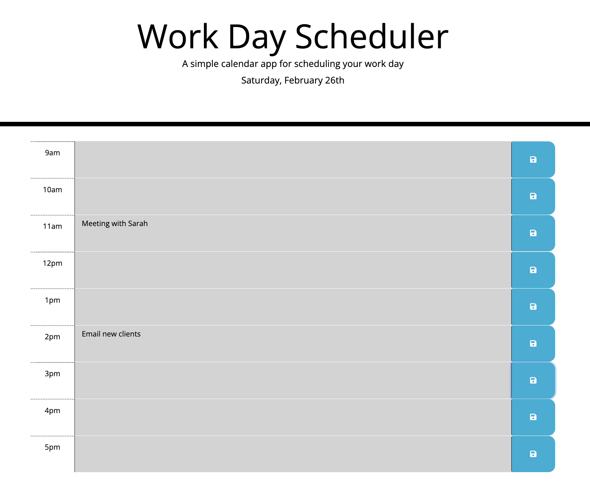

# Work Day Scheduler

## Purpose

An application that facilitates effective time management by allowing users to add important events to a real-time, color coded daily planner.

## Built With

- HTML
- CSS
- JavaScript

## Website

https://kelseyalderman.github.io/work-day-scheduler/

## Preview

## Contribution

Made with ❤️ by Kelsey Alderman
